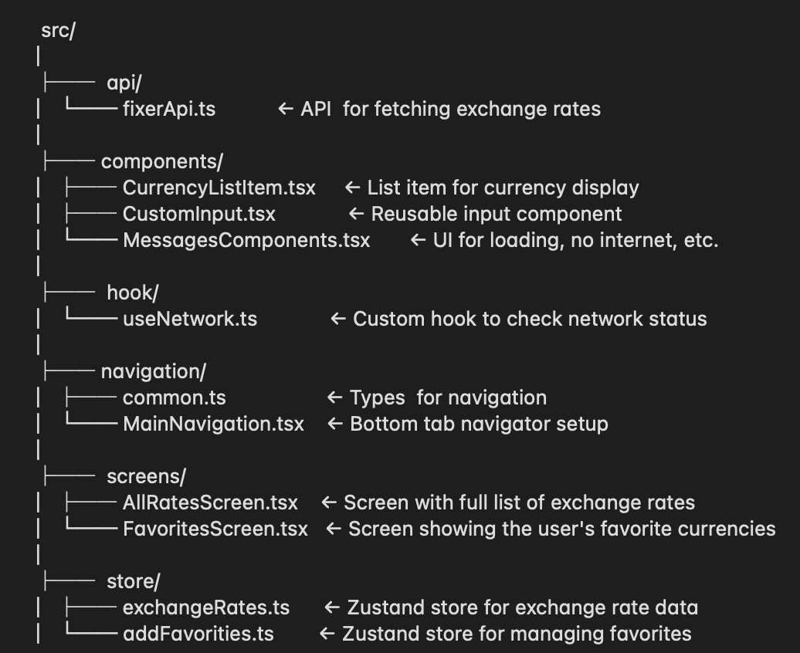

# CheckCurrency App

This mobile app provides up-to-date currency exchange rates, lets users save favorites, and supports offline access to previously viewed data.
## Getting Started

### Installation and Setup

1. **Clone the repository:**

   ```bash
   git clone https://github.com/OlexandraKorol/CheckCurrency
   cd CheckCurrency
   ```

2. **Install dependencies:**
   ```
   yarn install
   ```

3. **Set up the API key:**
   Add a `.env` file in the project root 

4. **Start the Metro Bundler:**

   ```bash
   npm start
   ```

---

### Running on Android

1. Launch the Android emulator via Android Studio or connect a physical device (make sure Developer Mode and USB debugging are enabled).

2. Run the app:

   ```bash
   npx react-native run-android
   ```

3. The app will build and launch on your emulator or device.

---

### Running on iOS

1. Install native dependencies using CocoaPods:

   ```bash
   cd ios && pod install && cd ..
   ```

2. Launch the iOS simulator or connect a physical device.

3. Run the app:

   ```bash
   npx react-native run-ios
   ```


## Functionality

1. **Two screens with Bottom Navigation**

   The app has two main screens accessible via bottom navigation:

   * `AllRatesScreen` — displays the full list of currencies
   * `FavoritesScreen` — displays the list of favorited currencies

2. **AllRatesScreen (All currencies)**

   This screen shows the complete list of exchange rates fetched from the API.
   A search field allows filtering currencies by code.

3. **FavoritesCurrency Screen (Favorite)**

   Displays only the currencies that the user has added to their favorites.
   Users can remove currencies from favorites directly on this screen.

4. **Adding/removing favorites**
   On both screens, each currency has a button (heart icon) to add or remove it from favorites.

5. **Offline mode**
   Exchange rates and favorites are cached locally using AsyncStorage.
   When there is no internet connection, the app displays favorite currencies.

## Tecnologies and Libraries

### Fixer.io
Free and simple API used to fetch real-time currency exchange rates. Acts as the data source for all exchange rate information in the app.
### Zustant
Lightweight and minimal state management library. Very simple to set up and use — ideal for small to medium-sized apps like this one. Helps manage app state without boilerplate.

### React Native Async Storage
Local storage system for persisting key-value pairs. Used here to cache exchange rates and user favorites for offline access.
### @react-native-community/netinfo
Library to monitor network connectivity. Used to detect online/offline mode and conditionally render content based on connection status.

## Architecture and structure 



### Navigation

- Built with `BottomTabNavigator`
- Two main screens:
  - `AllRatesScreen` – displays all exchange rates
  - `FavoritesScreen` – shows user-selected favorites


### Data Flow

- Exchange rates fetched from **Fixer API**
- Cached locally via **AsyncStorage** for offline access

### State Management

- `useExchangeRates` – fetches and stores exchange rates
- `useFavorites` – manages favorite currencies with persistence


## Design Choice
Used [react-native-paper](https://callstack.github.io/react-native-paper/) — a UI library designed specifically for React Native.

Reasons for using:

1. Comes with built-in components (buttons, cards, lists, etc.)
2. Supports Material Design out of the box
3. Includes icon support, default fonts, and color palette
4. Helps build consistent UI faster
5. Reduces the need to write common UI elements from scratch
6. Well-documented and developer-friendly — reduces time spent on UI tweaks
7. Helps keep the design consistent across platforms without additional styling tweaks

Used mainly to speed up UI development and ensure a clean, modern design with minimal setup.

## Offline Mode implemettation
The following approaches were used to implement Offline Mode:

1. Network connectivity detection
To check internet connectivity, the [@react-native-community/netinfo](https://www.npmjs.com/package/@react-native-community/netinfo) library was used.
Its main purpose is to detect whether the network is available.
For convenience, a custom hook was created that can be called in a component to retrieve network status and use it for conditional rendering.

2. Data caching in local storage
To store currency rates and favorite items locally, the [@react-native-async-storage/async-storage](https://www.npmjs.com/package/@react-native-async-storage/async-storage) library was used.

After currency rates are fetched from the API, they are saved to AsyncStorage under the ```@rates``` key. This allows the app to display cached data on the next launch if there is no network connection.

The list of favorite currencies stored under the ```favorites``` key is also saved in AsyncStorage, which allows users to access their favorites even when offline.

## Testing

- Using [React Native Testing Library](https://www.npmjs.com/package/@testing-library/react-native) for testing 
- Unit tests for main UI logic and interactive components
- Run tests with:
  ```bash
  npm test
